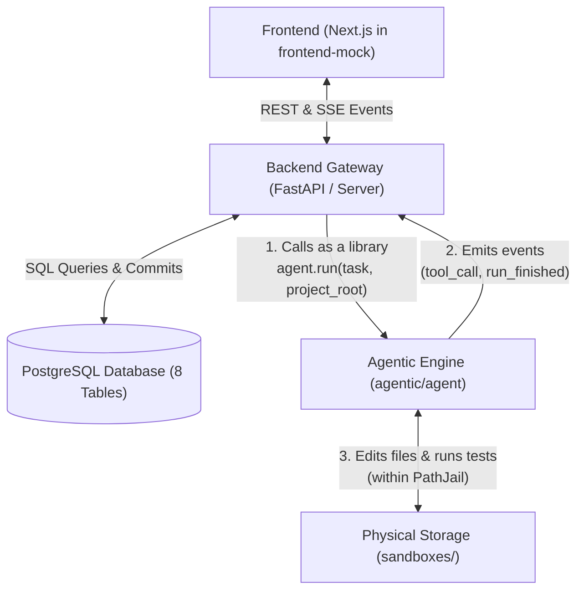

# Mini Coding Agent — Full System Architecture (Context Prompt)

**Audience:** an implementing agent or developer with zero prior context.
**Purpose of this document:** describe the whole system so every part is built to fit the others.
**Rule:** this is a context and planning document. Do NOT implement anything from it unless a separate build prompt tells you which part to build. Do NOT run hardware, GPU, or environment checks.

---

# 1. What is being built

A local-first coding agent (a small "Claude Code"-style tool). It takes a coding task, explores a project folder, edits files, runs commands and tests, reads the results, and retries, all inside a sandbox with a permission system.

The main goal is **learning how agentic systems work**, with **accuracy as the top priority** and speed as a non-priority. A slow agent that produces a wrong result has no value.

The system has three tiers plus shared resources:

```text
Frontend channels:   Web UI  |  CLI adapter  |  Voice adapter (later)
                          │ text events both ways
                          ▼
Backend API:         REST + event stream + run manager
                          │ calls as a library
                          ▼
Agentic service:     Agent loop | Context manager | Tool registry | Permission gate
                          │
       ┌──────────────────┼──────────────────┐
       ▼                  ▼                  ▼
  Model runtime       Sandbox           Storage
  (Ollama now,     (path jail +       (PostgreSQL +
   online later)   command allowlist   sandboxes/ traces)
                   + project folder)
```



Everything runs on one machine, in one Python process at first.

---

# 2. Core principles

1. **Model-agnostic core.** Every model call goes through one interface and one config file. Moving from a local model to an online API is a config change only.
2. **Channel-agnostic core.** The agent consumes text events and emits text events. Web UI, CLI, and voice are thin adapters with no agent logic.
3. **Events are the only contract between tiers.** No tier reaches into another tier's internals.
4. **Deterministic before LLM.** Anything code can decide (path checks, allowlists, budgets, test pass/fail) is decided by code, not the model.
5. **Objective feedback outranks the model.** Test results and exit codes decide success. The model's claim of success is never trusted.
6. **Everything is traced.** Every model call, tool call, approval, and result is recorded.
7. **Hard limits everywhere.** No loop is unbounded.
8. **No unnecessary technology.** No MCP, no message queues, no extra services, no agent frameworks unless a concrete need appears and the owner approves.

---

# 3. Runtime and technology

- Language: Python.
- Model runtime: Ollama over its local HTTP API. Model names come only from the config file. Model capabilities (tool calling, vision, context length) are NOT assumed; the tool layer must be robust to weak or malformed tool calls.
- Storage: PostgreSQL for durable multi-tenant data, projects/drafts metadata, chat history, and indexed run catalog (see `docs/DATABASE_SCHEMA.md`); plain files in external `sandboxes/` for per-run traces, snapshots, and diffs (SQLite retained only for standalone offline evaluation benchmark).
- Backend (built later): a small Python web framework exposing REST plus a server-sent-event stream.
- Frontend (built later): a simple web app.
- Test runner for sample projects: Python standard library `unittest`, to avoid extra dependencies.
- Adding any dependency beyond the standard library and one HTTP client requires the owner's confirmation.

---

# 4. Agentic service (the core)

## 4.1 The loop

```text
Observe   → read task, plan, recent results
Diagnose  → what is the state / what failed
Decide    → choose next action (tool call or finish)
Act       → run the tool through permission gate and sandbox
Reflect   → compare result to expectation (tests, exit codes)
Continue / Retry / Stop
```

Stop conditions (all required): verification command passes; step budget reached; time budget reached; retry limit for the same failure reached; no-progress detected (same call repeated, or N steps with no file change and no new information); user cancel.

On any stop the agent writes a final report.

## 4.2 Planning

The agent writes a short plan to a scratchpad file inside the run folder at the start and updates it as it goes. The plan is re-read every step, so it survives context trimming.

## 4.3 Model layer

- One interface: send messages and tool definitions, receive text and/or tool calls; report token usage and timing; support cancellation; support a thinking on/off setting where available.
- One config file with roles, never model names in code: `main`, `fallback`, `vision` (vision used only in a later phase). Each role sets provider, model name, context limit, thinking on/off, temperature, timeout.
- Tool-call robustness: validate arguments against a schema before executing; return a clear error to the model on invalid calls and count them; after N consecutive invalid calls, switch to `fallback`.

## 4.4 Tools (initial set, keep it small)

| Tool | Purpose | Risk |
|---|---|---|
| `list_files` | list a directory inside the jail | read |
| `read_file` | read a file with size and line-range limits | read |
| `search_text` | grep-like search across the project | read |
| `edit_file` | patch-based edit: replace a unique string; fails if missing or ambiguous | write |
| `create_file` | create a new file; fails if it exists | write |
| `run_command` | run an allowlisted command with timeout and output cap | execute |
| `run_tests` | run the configured test command; return only failing test names and key error lines | execute |
| `finish` | declare completion with a summary | control |

All tool outputs are short, structured, and size-limited, with a clear truncation marker.

## 4.5 Sandbox and permissions

- **Path jail:** the agent may only touch files inside one configured project root. Paths are resolved to absolute form and checked after resolving `..` and symlinks. Anything outside is refused and traced.
- **Command allowlist:** only explicitly allowed commands run (for example: the test command, `git status`, `git diff`). No shell chaining unless explicitly allowed. Every command has a timeout and output cap. No network commands.
- **Risk levels:** read = auto-approved; write = auto-approved inside the jail and traced (configurable to require approval); execute = allowlisted auto-approved, others need approval or are refused; destructive (deleting files, mass overwrite, anything outside the allowlist) = always needs explicit approval.
- Approvals are a yes/no question through the channel abstraction. A pending approval times out to **deny**.
- **Snapshot:** before the first edit of a run, snapshot the project (git commit or copy in the run folder) so every run can be rolled back.
- **Test protection:** test files are read-only to the agent by default. Editing tests needs explicit approval. A run only counts as successful if the verification command passes and tests were not modified.

## 4.6 Context management

Local models degrade on long contexts, so this is a first-class module.

- Configurable working context limit (start at about 8k tokens).
- Always keep: system prompt, task, current plan, and the last few steps in full.
- Older steps become one-line summaries (action, result, outcome).
- Load files only when needed, by line range.
- Report context budget use in the trace every step.

## 4.7 Retry and accuracy levers

Accuracy is bought with time. All of these are configurable:

1. Thinking mode on for planning and failure diagnosis, where supported.
2. Retries that include the previous failed attempt and exact error.
3. Best-of-N independent attempts; keep the first that passes verification.
4. Fallback to a stronger model after the retry limit.
5. Plan first, then act.
6. Final independent verification: rerun the full test suite from a clean state after the last edit.

Also: stop if N consecutive test runs show no improvement in the number of failing tests.

## 4.8 Tracing and run isolation

```text
sandboxes/
├── projects/<project_id>/            # Clean multi-file codebase
├── drafts/<draft_id>/                # Ephemeral single-concept canvas
└── runs/                             # Scoped execution traces
    ├── projects/<project_id>/<run_id>/
    └── drafts/<draft_id>/<run_id>/
        ├── events.jsonl              # append-only, written during the run
        ├── run.json                  # summary written at the end
        ├── plan.md                   # scratchpad plan
        ├── snapshot/                 # pre-run baseline for rollback/diffing
        └── artifacts/                # changes.diff, test outputs
```

`events.jsonl` records per event: timestamp, step number, event type, model role and name, token counts, duration, and enough input and output to reconstruct the step. `run.json` summarizes task, config used, steps, tool counts, test results before and after, stop reason, total time, and final status. Runs never merge. Shared durable data (entities, relationships, chat history, and run indexes across 50+ projects) lives in PostgreSQL (see `docs/DATABASE_SCHEMA.md`).

## 4.9 Final report

Every run ends with a report: what was asked, what was done, files changed with diff, test results before and after, why it stopped, and anything unresolved. If tests still fail, the report says so plainly.

---

# 5. Event contract (the only interface between tiers)

**Input events (frontend → backend → agent):**
- `task.submit` — task description, project root, verification command, budgets
- `approval.answer` — approval id, yes or no
- `run.cancel` — run id
- `message.followup` — extra user message during a run (optional in phase 1)

**Output events (agent → backend → frontend):**
- `run.started` — run id, config summary
- `step.progress` — step number, short human-readable description
- `tool.call` and `tool.result` — name, arguments summary, result summary
- `approval.request` — approval id, action, risk level, reason
- `run.finished` — status, stop reason, report location
- `speech.summary` — one or two plain sentences, no code, for a future voice adapter (produced even when no voice adapter exists)

Every event carries: event id, run id, timestamp, type, payload.

---

# 6. Backend API (built after the agent works)

A thin layer with no agent logic, backed by PostgreSQL adhering strictly to `docs/DATABASE_SCHEMA.md`:

- start a run (accepts `task.submit`, provisions folder in `sandboxes/`)
- stream events for a run (server-sent events)
- answer an approval
- cancel a run
- list projects, drafts, and fetch run traces and diffs from `agent_runs` table

Runs execute in a worker thread or subprocess so cancel works without freezing the API. The agentic service is imported as a Python library, not a separate server. A separation into its own process is a later, optional change made possible by the event contract.

---

# 7. Frontend (built after the backend works)

- Task input and project selection.
- Live run timeline built from the event stream.
- Diff viewer for changed files.
- Approve or deny buttons for approval requests.
- Cancel button.
- Run history with reports.

Later: a design-mode preview pane (iframe) and a voice button. Neither requires changes to the agentic service beyond new tools and adapters.

---

# 8. Evaluation harness

A small suite of sample projects, each with a task and a failing test command. Start with 3 to 5 tiny projects (an off-by-one bug, a missing function, a wrong import, a small feature with tests). A runner executes the agent on each with a chosen model config and records pass/fail, steps, time, and tokens into SQLite so models and settings can be compared.

**Accuracy gate.** The owner sets pass-rate thresholds before seeing results. Suggested starting point: at least 70% on easy single-file tasks. Outcomes: met with local models = continue; met only with extra levers (best-of-N, thinking, fallback) = continue and record the time cost; not met even with all levers = switch the `main` role to an online model through config and keep the architecture. No accuracy figure may be assumed before it is measured.

---

# 9. Build order

1. Tiny sample projects with failing tests.
2. Model client and config.
3. Read-only loop with tracing, driven from a CLI.
4. Sandbox and permissions.
5. Edit and test loop with retries and the scratchpad plan.
6. Context management and the eval runner.
7. Backend API.
8. Frontend.
9. Later: sequential subagents, design mode (UI generation with preview and screenshots), voice adapter, optional online models.

---

# 10. Engineering rules

- Build one step at a time. After each step, run its acceptance check, report the result, and wait for the owner's confirmation before the next step.
- Do not change the architecture, event contract, or principles silently. Explain the change, the reason, and the proposed edit, then wait for confirmation.
- Do not add dependencies, services, or frameworks without confirmation.
- Do not run hardware, GPU, or environment probing. Assume Ollama is reachable at its default local address and that model names come from the config file.
- Keep this document as the single evolving source of truth for architecture.
