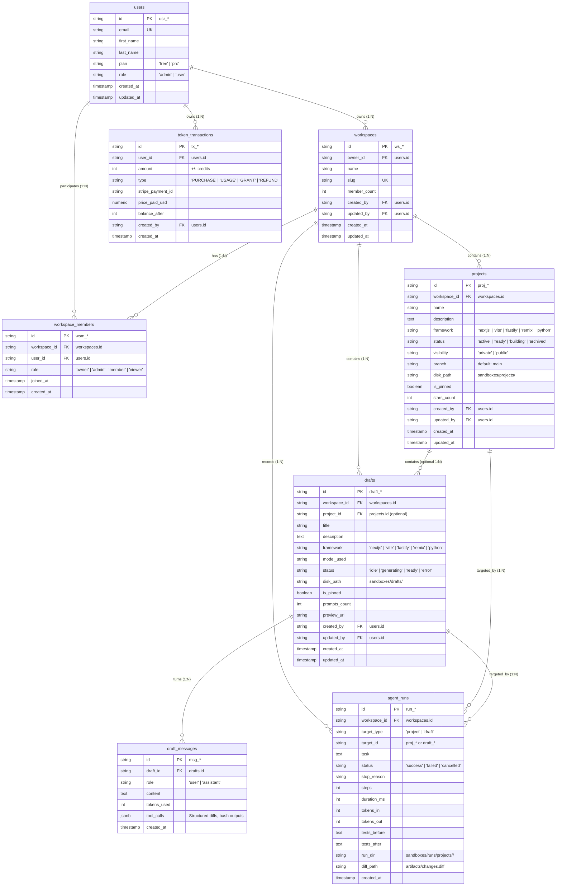
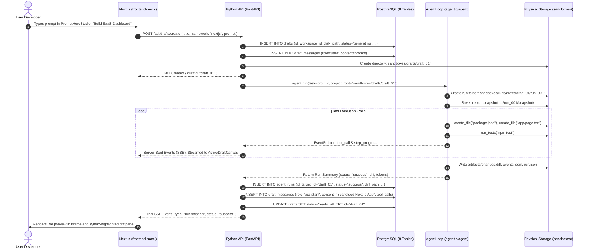

# Tinker Platform — Canonical Database Specification & Uniformity Guide

> **Single Source of Truth (SSOT)** for all data models, PostgreSQL tables, relationships, and cross-tier conventions across:
> - **Frontend**: Next.js (`frontend-mock/lib/types.ts`)
> - **Backend API**: Python FastAPI (`app/models/`, `app/schemas/`)
> - **Agent Engine**: Autonomous Loop (`agentic/agent/`)
> - **Physical Storage**: File System Sandboxes (`sandboxes/`)

---

## 1. System Invariants & Uniformity Rules

To prevent architectural drift where the Backend, Frontend, and Agentic engine follow divergent schemas:

1. **Snake_Case in PostgreSQL, CamelCase in TypeScript/JSON, Snake_Case in Python**:
   - PostgreSQL column: `workspace_id`
   - Python field: `workspace_id`
   - REST API JSON & Frontend TypeScript: `workspaceId` (automatic Pydantic `camelCase` alias / serialiser).
2. **Deterministic String Primary Keys**:
   - All IDs are prefixed, human-readable strings to make debugging instant across logs:
     - Users: `usr_<uuid/slug>`
     - Workspaces: `ws_<slug>`
     - Projects: `proj_<name/uuid>`
     - Drafts: `draft_<slug/uuid>`
     - Messages: `msg_<uuid>`
     - Transactions: `tx_<uuid>`
     - Workspace Members: `wsm_<uuid>`
     - Agent Runs: `run_<timestamp>_<hex>`
3. **No Redundant Tables**:
   - `AUDIT_LOGS` is **dropped** for the current phase. Activity feeds are derived dynamically from `agent_runs`.
4. **Physical Disk Linkage**:
   - `projects` and `drafts` MUST always store their relative disk path (`disk_path`), which is passed directly to the Agent's `PathJail` and `RunTracer`.

---

## 2. Table Summary (Exactly 8 Core Tables)

| # | Table Name | Purpose | Target Tier |
|---|---|---|---|
| 1 | `users` | Authenticated developers & account holders | Auth & Billing |
| 2 | `workspaces` | Multi-tenant tenant boundary (Quota: 1 Free / 5 Pro) | Platform Core |
| 3 | `workspace_members` | Workspace RBAC memberships (owner, admin, member, viewer) | Auth & Collaboration |
| 4 | `token_transactions` | Immutable credit balance ledger (purchases, agent usage) | Billing & Ledger |
| 5 | `projects` | Multi-file, long-lived repositories & sandboxes | Projects & Code |
| 6 | `drafts` | Ephemeral scratchpads & single-canvas prompt threads | Studio & Chat |
| 7 | `draft_messages` | Multi-turn conversational history with tool call payloads | AI Chat Thread |
| 8 | `agent_runs` | Immutable execution index (steps, status, diffs, tokens) | Agentic Engine |

---

## 3. Entity-Relationship Diagram (ERD)



---

## 4. Comprehensive Table & Field Reference

This section details **what each table stores**, **what each field holds**, and **why each column exists**.

### 4.1 Table: `users`
* **What it stores**: Registered developers and account holders authenticated via OAuth or email/password.
* **Fields**:
  - `id`: Unique user identifier (e.g. `usr_28d9c1`). Used as foreign key across workspaces and transactions.
  - `email`: Unique login email address.
  - `first_name`: User's given name for UI greeting and avatar initials.
  - `last_name`: User's surname.
  - `plan`: Subscription tier. Enforces workspace creation limits and model availability.
  - `role`: System-level platform privilege (`admin` vs `user`).
  - `created_at`: Timestamp when account was created.
  - `updated_at`: Timestamp of last profile modification.

### 4.2 Table: `workspaces`
* **What it stores**: The top-level tenant boundaries. Every project, draft, and team member belongs to a workspace.
* **Fields**:
  - `id`: Unique workspace identifier (e.g. `ws_acme_corp`).
  - `owner_id`: Foreign key to `users.id` identifying the primary account owner who pays for the workspace.
  - `name`: Human-readable display name (e.g. `"Acme Corp"`, `"Personal"`).
  - `slug`: URL-friendly identifier used in navigation routes (e.g. `"acme-corp"`).
  - `member_count`: Cached count of current active collaborators.
  - `created_by`: Foreign key to `users.id` of the creator.
  - `updated_by`: Foreign key to `users.id` of the last person who updated settings.
  - `created_at`: Timestamp when workspace was provisioned.
  - `updated_at`: Timestamp when workspace was last edited.

### 4.3 Table: `workspace_members`
* **What it stores**: Team access and collaboration roles for users who have been invited to a workspace.
* **Fields**:
  - `id`: Membership record identifier (e.g. `wsm_01`).
  - `workspace_id`: Foreign key to `workspaces.id`.
  - `user_id`: Foreign key to `users.id`.
  - `role`: Permission level of this member within this specific workspace (`owner`, `admin`, `member`, `viewer`).
  - `joined_at`: Timestamp when invitation was accepted.
  - `created_at`: Timestamp when invitation record was created.
* **Constraints**: `UNIQUE(workspace_id, user_id)` prevents duplicate member entries.

### 4.4 Table: `token_transactions`
* **What it stores**: An immutable credit ledger recording every addition and deduction of AI inference credits. Balance is never updated in place without a ledger transaction.
* **Fields**:
  - `id`: Transaction record identifier (e.g. `tx_98a7b6`).
  - `user_id`: Foreign key to `users.id` whose credit balance is affected.
  - `amount`: Signed integer (+credits for purchases/grants, -credits for agent runs).
  - `type`: Category of transaction (`PURCHASE`, `USAGE`, `GRANT`, `REFUND`).
  - `stripe_payment_id`: Optional external Stripe checkout session or charge ID.
  - `price_paid_usd`: Real money paid in USD (if a purchase).
  - `balance_after`: Running snapshot of remaining credits after this transaction.
  - `created_by`: Foreign key to `users.id` who initiated the transaction.
  - `created_at`: Timestamp when transaction occurred.

### 4.5 Table: `projects`
* **What it stores**: Long-lived, multi-file codebases and full repositories with package managers and test suites.
* **Fields**:
  - `id`: Project identifier (e.g. `proj_saas_analytics`).
  - `workspace_id`: Foreign key to `workspaces.id`.
  - `name`: Display name of the project.
  - `description`: Optional overview of what the application does.
  - `framework`: Primary single framework stack (`nextjs`, `vite`, `fastify`, `remix`, `python`).
  - `status`: Lifecycle state (`active`, `ready`, `building`, `archived`).
  - `visibility`: Access scope (`private` to workspace vs `public` preview link).
  - `branch`: Current active git branch (default: `'main'`).
  - `disk_path`: Relative filesystem location (e.g. `sandboxes/projects/proj_saas_analytics`). Passed to `PathJail`.
  - `is_pinned`: Boolean flag to pin favorite projects to the top of the sidebar.
  - `stars_count`: Social / bookmark counter.
  - `created_by`: Foreign key to `users.id`.
  - `updated_by`: Foreign key to `users.id`.
  - `created_at`: Timestamp when created.
  - `updated_at`: Timestamp when last modified.

### 4.6 Table: `drafts`
* **What it stores**: Ephemeral, prompt-driven scratchpads and isolated canvas prototypes.
* **Fields**:
  - `id`: Draft identifier (e.g. `draft_8f2a1b`).
  - `workspace_id`: Foreign key to `workspaces.id`.
  - `project_id`: Optional foreign key to `projects.id` if this draft belongs to or was branched from a parent project.
  - `title`: Short title of the draft (derived from the first prompt).
  - `description`: The full initial prompt explaining the concept.
  - `framework`: The single target framework stack.
  - `model_used`: Name of LLM model used (e.g. `'gemma4:latest'`, `'qwen3.5:9b'`).
  - `status`: Execution state (`idle`, `generating`, `ready`, `error`).
  - `disk_path`: Relative disk location (e.g. `sandboxes/drafts/draft_8f2a1b`).
  - `is_pinned`: Boolean flag to pin important drafts.
  - `prompts_count`: Number of user turns submitted in this thread.
  - `preview_url`: Internal or WebContainer URL for live iframe rendering.
  - `created_by`: Foreign key to `users.id`.
  - `updated_by`: Foreign key to `users.id`.
  - `created_at`: Timestamp of initial creation.
  - `updated_at`: Timestamp of last edit.

### 4.7 Table: `draft_messages`
* **What it stores**: Individual conversation turns in a draft between the human developer and the AI coding agent.
* **Fields**:
  - `id`: Message identifier (e.g. `msg_10a2`).
  - `draft_id`: Foreign key to `drafts.id`.
  - `role`: Message sender (`user` or `assistant`).
  - `content`: Text of the user prompt or assistant's natural language response.
  - `tokens_used`: Total tokens burned during this turn.
  - `tool_calls`: JSONB payload capturing tool execution history (tool name, arguments, syntax diffs, terminal outputs).
  - `created_at`: Timestamp when message turn occurred.

### 4.8 Table: `agent_runs`
* **What it stores**: Complete audit index of every autonomous execution cycle run by `AgentLoop`. Enables sub-2ms historical lookups across 50+ projects.
* **Fields**:
  - `id`: Unique run identifier (e.g. `run_20261001_114500_0ad96d`).
  - `workspace_id`: Foreign key to `workspaces.id`.
  - `target_type`: Distinguishes if this run operated on a `'project'` or a `'draft'`.
  - `target_id`: ID of the targeted project or draft.
  - `task`: The exact task prompt given to the agent for this run.
  - `status`: High-level outcome (`success`, `failed`, `cancelled`).
  - `stop_reason`: Detailed reason why the loop ended (`verified_success`, `step_budget`, `no_progress`, etc.).
  - `steps`: Total Observe-Diagnose-Act cycles taken.
  - `duration_ms`: Total wall-clock time in milliseconds.
  - `tokens_in`: Total input prompt tokens sent to Ollama.
  - `tokens_out`: Total completion tokens generated.
  - `tests_before`: Summary of baseline test execution before any file edits were made.
  - `tests_after`: Summary of test execution after final edits.
  - `run_dir`: Physical path to run folder (e.g. `sandboxes/runs/projects/proj_01/run_001/`). Contains `events.jsonl` and `snapshot/`.
  - `diff_path`: Physical path to `artifacts/changes.diff`.
  - `created_at`: Timestamp when run finished.

---

## 5. Comprehensive Enum Reference Guide

This section explains **every enum value in the system**, **what it means**, and **when it is triggered**.

### 5.1 `users.plan`
| Enum Value | Meaning | Business Rule & System Behavior |
|---|---|---|
| `'free'` | Default Tier | Limited to **1 Workspace**. Standard context budget and rate limits. |
| `'pro'` | Paid Subscription | Allowed up to **5 Workspaces**. Higher token budgets, priority local queue, fallback model support. |

### 5.2 `users.role`
| Enum Value | Meaning | System Behavior |
|---|---|---|
| `'admin'` | Platform Superuser | Full system administrative access; can view platform metrics, manage all users, and grant credits. |
| `'user'` | Standard Developer | Regular platform user; can create workspaces, write prompts, and build applications within their quota. |

### 5.3 `workspace_members.role`
| Enum Value | Meaning | Workspace Permissions |
|---|---|---|
| `'owner'` | Workspace Creator | Full billing control, can transfer workspace ownership or delete the workspace. (Aligned with `workspaces.owner_id`). |
| `'admin'` | Workspace Manager | Can invite and remove members, create and delete projects, and edit workspace settings. |
| `'member'` | Standard Developer | Can create drafts, chat with the agent, generate code, edit files, and run tests. |
| `'viewer'` | Read-Only Collaborator | Can view code files, diffs, and live previews, but **cannot call the agent** or spend workspace credits. |

### 5.4 `token_transactions.type`
| Enum Value | Meaning | Ledger Effect |
|---|---|---|
| `'PURCHASE'` | Paid Credit Pack | User bought tokens via Stripe (`+amount`, `price_paid_usd` recorded). |
| `'USAGE'` | Inference Burn | Agent consumed tokens during a run (`-amount`, deducted from balance). |
| `'GRANT'` | Promotional Credit | Free credits granted on signup, promotion, or monthly renewal (`+amount`). |
| `'REFUND'` | Failed Run Recredit | Credits refunded if an agent run failed due to system error or timeout (`+amount`). |

### 5.5 `projects.framework` & `drafts.framework`
*Enforces Single-Stack Exclusivity (Rule 1: Never mix frameworks in one directory).*

| Enum Value | Meaning | Default Verification Command |
|---|---|---|
| `'nextjs'` | Next.js App Router | `npm test` or `npx next build` |
| `'vite'` | Vite + React Web App | `npm test` or `npx vite build` |
| `'fastify'` | Fastify Node.js REST API | `npm test` |
| `'remix'` | Remix Fullstack Web App | `npm test` |
| `'python'` | Python Standard App | `python -m unittest discover` |

### 5.6 `projects.status`
| Enum Value | Meaning | System Behavior |
|---|---|---|
| `'active'` | Currently Active | The project currently open in the editor or workspace canvas. |
| `'ready'` | Verified & Idle | Stable repository ready for new tasks and verified passing tests. |
| `'building'` | Compiling / Scaffolding | The agent is currently scaffolding directories or running background installs. |
| `'archived'` | Read-Only | Soft-deleted project; retained on disk but hidden from active lists. |

### 5.7 `projects.visibility`
| Enum Value | Meaning | Access Control |
|---|---|---|
| `'private'` | Restricted | Only members of the workspace can view, open, or clone the project. |
| `'public'` | Shareable | Generates a public preview link for client review or community showcase. |

### 5.8 `drafts.status`
| Enum Value | Meaning | UI State in `ActiveDraftCanvas` |
|---|---|---|
| `'idle'` | Awaiting Input | Ready for the developer's next prompt. Input box enabled. |
| `'generating'` | Agent Working | Prompt sent; agent is currently reasoning, calling tools, or editing files. Progress spinner shown. |
| `'ready'` | Execution Finished | Agent finished work; live diff panel rendered and preview updated. |
| `'error'` | Run Failed | Agent encountered an unrecoverable failure or budget stop. Error card shown. |

### 5.9 `draft_messages.role`
| Enum Value | Meaning | Message Rendering |
|---|---|---|
| `'user'` | Human Developer | Rendered as a user prompt bubble with timestamp and edit options. |
| `'assistant'` | Tinker Agent | Rendered as an agent turn with tool call accordions, syntax diffs, and execution duration. |

### 5.10 `agent_runs.target_type`
| Enum Value | Meaning | Storage Path & Scope |
|---|---|---|
| `'project'` | Multi-File Repo | Operates in `sandboxes/projects/<id>/` with full test suites. |
| `'draft'` | Lightweight Canvas | Operates in `sandboxes/drafts/<id>/` on focused single-concept files. |

### 5.11 `agent_runs.status`
| Enum Value | Meaning | Exit Code & Badge |
|---|---|---|
| `'success'` | Task Complete | All independent tests passed cleanly and `finish` was called. Green check. |
| `'failed'` | Verification Failed | Tests failed, budget was reached, or agent stalled. Red alert. |
| `'cancelled'` | User Cancelled | User pressed Ctrl+C or clicked the Cancel button in UI. Amber icon. |

### 5.12 `agent_runs.stop_reason`
| Enum Value | Meaning | Trigger Condition |
|---|---|---|
| `'verified_success'` | Verified Success | Independent test run passed and tests were not modified. |
| `'step_budget'` | Max Steps Exceeded | Reached `max_steps` (default: 30) without completing the task. |
| `'time_budget'` | Timeout Exceeded | Reached `max_time_seconds` (default: 600s). |
| `'no_progress'` | Stalled Execution | Repeated the same tool call 3 times or had 6 steps without code modification. |
| `'retry_limit_reached'` | Model Limit | Failed on the same test error 3 times on both main and fallback models. |
| `'test_files_modified'` | Integrity Violation | Agent illegally modified protected test files to fake a passing run. |
| `'user_cancel'` | Aborted by User | Graceful cancellation via `SIGINT` or UI Cancel button. |

---

## 6. High-Performance PostgreSQL Indexes

To guarantee sub-2ms query performance when searching across 50+ projects and thousands of runs:

```sql
-- Fast lookup of runs for any project or draft
CREATE INDEX idx_runs_target ON agent_runs(target_id, created_at DESC);

-- Fast lookup of all runs in a workspace
CREATE INDEX idx_runs_workspace ON agent_runs(workspace_id, created_at DESC);

-- Fast chronological chat message rendering
CREATE INDEX idx_messages_draft ON draft_messages(draft_id, created_at ASC);

-- Unique membership check
CREATE UNIQUE INDEX idx_unique_workspace_member ON workspace_members(workspace_id, user_id);

-- Instant workspace slug routing
CREATE UNIQUE INDEX idx_workspaces_slug ON workspaces(slug);
```

---

## 7. Canonical PostgreSQL DDL Migration (V1)

```sql
-- =============================================================================
-- Tinker PostgreSQL Schema Migration (V1)
-- Matches ERD Section 3 and Data Dictionary Section 4 exactly.
-- =============================================================================

CREATE TABLE IF NOT EXISTS users (
    id VARCHAR(50) PRIMARY KEY,
    email VARCHAR(255) NOT NULL UNIQUE,
    first_name VARCHAR(100),
    last_name VARCHAR(100),
    plan VARCHAR(20) NOT NULL DEFAULT 'free' CHECK (plan IN ('free', 'pro')),
    role VARCHAR(20) NOT NULL DEFAULT 'user' CHECK (role IN ('admin', 'user')),
    created_at TIMESTAMPTZ DEFAULT NOW(),
    updated_at TIMESTAMPTZ DEFAULT NOW()
);

CREATE TABLE IF NOT EXISTS workspaces (
    id VARCHAR(50) PRIMARY KEY,
    owner_id VARCHAR(50) NOT NULL REFERENCES users(id) ON DELETE CASCADE,
    name VARCHAR(100) NOT NULL,
    slug VARCHAR(100) NOT NULL UNIQUE,
    member_count INT NOT NULL DEFAULT 1,
    created_by VARCHAR(50) NOT NULL REFERENCES users(id),
    updated_by VARCHAR(50) NOT NULL REFERENCES users(id),
    created_at TIMESTAMPTZ DEFAULT NOW(),
    updated_at TIMESTAMPTZ DEFAULT NOW()
);

CREATE TABLE IF NOT EXISTS workspace_members (
    id VARCHAR(50) PRIMARY KEY,
    workspace_id VARCHAR(50) NOT NULL REFERENCES workspaces(id) ON DELETE CASCADE,
    user_id VARCHAR(50) NOT NULL REFERENCES users(id) ON DELETE CASCADE,
    role VARCHAR(20) NOT NULL DEFAULT 'member' CHECK (role IN ('owner', 'admin', 'member', 'viewer')),
    joined_at TIMESTAMPTZ DEFAULT NOW(),
    created_at TIMESTAMPTZ DEFAULT NOW(),
    CONSTRAINT uq_workspace_member UNIQUE (workspace_id, user_id)
);

CREATE TABLE IF NOT EXISTS token_transactions (
    id VARCHAR(50) PRIMARY KEY,
    user_id VARCHAR(50) NOT NULL REFERENCES users(id) ON DELETE CASCADE,
    amount INT NOT NULL,
    type VARCHAR(20) NOT NULL CHECK (type IN ('PURCHASE', 'USAGE', 'GRANT', 'REFUND')),
    stripe_payment_id VARCHAR(100),
    price_paid_usd NUMERIC(10, 2),
    balance_after INT NOT NULL,
    created_by VARCHAR(50) NOT NULL REFERENCES users(id),
    created_at TIMESTAMPTZ DEFAULT NOW()
);

CREATE TABLE IF NOT EXISTS projects (
    id VARCHAR(50) PRIMARY KEY,
    workspace_id VARCHAR(50) NOT NULL REFERENCES workspaces(id) ON DELETE CASCADE,
    name VARCHAR(100) NOT NULL,
    description TEXT,
    framework VARCHAR(50) NOT NULL CHECK (framework IN ('nextjs', 'vite', 'fastify', 'remix', 'python')),
    status VARCHAR(30) NOT NULL DEFAULT 'ready' CHECK (status IN ('active', 'ready', 'building', 'archived')),
    visibility VARCHAR(20) NOT NULL DEFAULT 'private' CHECK (visibility IN ('private', 'public')),
    branch VARCHAR(100) DEFAULT 'main',
    disk_path VARCHAR(255) NOT NULL,
    is_pinned BOOLEAN DEFAULT FALSE,
    stars_count INT DEFAULT 0,
    created_by VARCHAR(50) NOT NULL REFERENCES users(id),
    updated_by VARCHAR(50) NOT NULL REFERENCES users(id),
    created_at TIMESTAMPTZ DEFAULT NOW(),
    updated_at TIMESTAMPTZ DEFAULT NOW()
);

CREATE TABLE IF NOT EXISTS drafts (
    id VARCHAR(50) PRIMARY KEY,
    workspace_id VARCHAR(50) NOT NULL REFERENCES workspaces(id) ON DELETE CASCADE,
    project_id VARCHAR(50) REFERENCES projects(id) ON DELETE SET NULL,
    title VARCHAR(150) NOT NULL,
    description TEXT,
    framework VARCHAR(50) NOT NULL CHECK (framework IN ('nextjs', 'vite', 'fastify', 'remix', 'python')),
    model_used VARCHAR(100) NOT NULL,
    status VARCHAR(30) NOT NULL DEFAULT 'idle' CHECK (status IN ('idle', 'generating', 'ready', 'error')),
    disk_path VARCHAR(255) NOT NULL,
    is_pinned BOOLEAN DEFAULT FALSE,
    prompts_count INT DEFAULT 0,
    preview_url VARCHAR(255),
    created_by VARCHAR(50) NOT NULL REFERENCES users(id),
    updated_by VARCHAR(50) NOT NULL REFERENCES users(id),
    created_at TIMESTAMPTZ DEFAULT NOW(),
    updated_at TIMESTAMPTZ DEFAULT NOW()
);

CREATE TABLE IF NOT EXISTS draft_messages (
    id VARCHAR(50) PRIMARY KEY,
    draft_id VARCHAR(50) NOT NULL REFERENCES drafts(id) ON DELETE CASCADE,
    role VARCHAR(20) NOT NULL CHECK (role IN ('user', 'assistant')),
    content TEXT NOT NULL,
    tokens_used INT DEFAULT 0,
    tool_calls JSONB,
    created_at TIMESTAMPTZ DEFAULT NOW()
);

CREATE TABLE IF NOT EXISTS agent_runs (
    id VARCHAR(80) PRIMARY KEY,
    workspace_id VARCHAR(50) NOT NULL REFERENCES workspaces(id) ON DELETE CASCADE,
    target_type VARCHAR(20) NOT NULL CHECK (target_type IN ('project', 'draft')),
    target_id VARCHAR(50) NOT NULL,
    task TEXT NOT NULL,
    status VARCHAR(30) NOT NULL CHECK (status IN ('success', 'failed', 'cancelled')),
    stop_reason VARCHAR(100) NOT NULL,
    steps INT DEFAULT 0,
    duration_ms INT DEFAULT 0,
    tokens_in INT DEFAULT 0,
    tokens_out INT DEFAULT 0,
    tests_before TEXT,
    tests_after TEXT,
    run_dir VARCHAR(255) NOT NULL,
    diff_path VARCHAR(255),
    created_at TIMESTAMPTZ DEFAULT NOW()
);

-- Indexes
CREATE INDEX IF NOT EXISTS idx_runs_target ON agent_runs(target_id, created_at DESC);
CREATE INDEX IF NOT EXISTS idx_runs_workspace ON agent_runs(workspace_id, created_at DESC);
CREATE INDEX IF NOT EXISTS idx_messages_draft ON draft_messages(draft_id, created_at ASC);
CREATE INDEX IF NOT EXISTS idx_workspaces_owner ON workspaces(owner_id);
```

---

## 8. Multi-Tier End-to-End Operational Flow

This diagram illustrates how data flows synchronously between the **Next.js UI**, **Python FastAPI Gateway**, **PostgreSQL**, **Agent Engine (`AgentLoop`)**, and the **Filesystem (`sandboxes/`)**:


